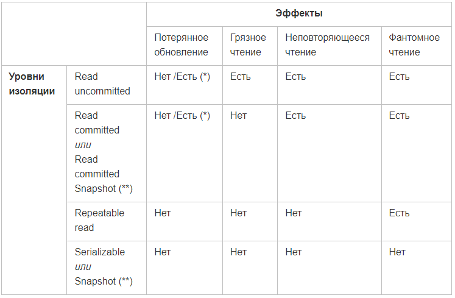

# SQL
### Нормальные формы
Нормализация - это метод проектирования баз данных, который позволяет привести БД к минимальной избыточности
Она нужна для:
- Устранения аномалий (одни и те же данные в разных местах не соответствуют друг другу)
- Повышения производительности
- Повышения удобства упрадления данными

Функциональная зависимость: Множество B функционально зависит от множества A тогда и только тогда, когда каждое значение
множества A связано в точности с одним значением множетсва B. То есть если два картежа совпадают по значениям из А,
то и совпадают по значениям из B. 

A -> B <=> (Для любого t1, t2: t1(A)=t2(A) => t1(B)=t2(B))

Полный порядок нормальных форм:
1) Ненормализованная форма или нулевая нормальная форма (0NF)

Перед нормализацией БД, требуется привести ее к табличному виду
так, чтобы она отвечала базовым принципам реляционной модели.
То есть строки и столбцы не должны быть пронумерованы (порядок столбцов и строк не важен)

2) Первая нормальная форма (1NF)

Таблицы должны соответствовать принципам реляционной модели и соблюдать следующие принципы:
- В таблице не должно быть строк-дублей
- В каждой ячейке таблицы хранятся атомарные значения
- В столбце хранятся данные одного типа
- Нет списков и массивов в любом виде
       
3) Вторая нормальная форма (2NF)

Таблицы должны соответствовать следующим принципам:
- Она должна находится в 1NF
- Таблица должна иметь ключ
- Все неключевые столбцы должны зависеть от полного ключа (в случае если ключ составной)

Декомпозиция - процесс разбиения одного отношения на несколько

4) Третья нормальная форма (3NF)

Таблицы должны соответствовать следующим принципам:
- Она должна находится в 2NF
- В таблицах должны отсутствовать транзитивные зависимости

Транзитивная зависимость - когда неключевые столбцы зависят от значений других неключевых столбцов

5) Нормальная форма Бойса-Кодда (BCNF)

Таблицы должны соответствовать следующим принципам:
- Она должна находится в 3NF
- Ключевые атрибуты составного ключа не должны зависеть от неключевых столбцов

Актуальна только для таблиц с составным ключом

6) Четвертая нормальная форма (4NF)

Таблицы должны соответствовать следующим принципам:
- Она должна находится в 3NF (BCNF)
- В таблицах должны отсутствовать нетривиальные многозначные зависимости

Пример многозначной зависимости:
Есть таблица со столбцами A, B, C. B и C между собой никак не связаны, но по отдельности они зависят от A. 
Причем для каждого значения A есть множество значений B и множество значений C.

7) Пятая нормальная форма (5NF)

Отношение находится в 5NF тогда и только тогда, когда каждая нетривиальная зависимость соединения в ней определяется
потенциальным ключом этого отношения.

8) Доменно-ключевая нормальная форма (DKNF)

Требование:
- Таблица находится в 5NF
- Каждое наложенное ограничение должно являться логическим следствием ограничений доменов и ограничений ключей,
которые накладываются на эту таблицу

9) Шестая нормальная форма (6NF)

Требование:
- Таблица находится в DKNF
- Таблица находится в 6NF, когда она неприводима, то есть не может быть подвергнута декомпозиции без потерь

### Индексы

Создание индекса:

            CREATE INDEX [index_name]
            ON [table_name] ([column_name]);

В инструкции where БД сначала будет искать по индексированному полю (в не зависимости от порядка в where)

План выполнения запроса - последовательность операций для полечения результата SQL-запроса в реляционной системе СУБД

Важно помнить:
- Индексам необходимо место для хранения
- При добавлении данных в таблицу или их обновлении, сначала обновляется исходная таблица, а затем все ее индексы

Типы индексов:
- Кластеризованный
- Некластеризованный
 
Индексы можно создавать для таблиц и представлений.

Рекомендации:
- Не применять индексы в небольших таблицах
- Не применять индексы в таблицах которые часто обновляются
- Индексы желательно применять к тем столбцам, по которым наиболее часто ведется поиск
- Стоит планировать индексы, когда в таблице минимум 10000 тысяч строк.
- Не применять индекс с теми столбцами базы данных, с которыми будут производиться частые действия
- Большое количество индексов замедляют действия связанные с вставкой, обновлением и удалением строк в таблице
базы данных, так как происходит обновление самих индексов.
- Индексы потребляют дополнительный объем памяти. Так как хранятся отдельно от таблицы

### Транзакции

Транзацкия - набор операций, которые составляют одну атомарную единицу. Должны выполнять требования ACID,
которые обеспечивают безопасность данных.

ACID расшифровка:
1) A - Atomicity (Атомарность):

Гарантирует, что транзакция будет выполнена полностью или не выполнена совсем.

2) C - Consistency (Согласованность):

Свойство гарантирует, что по мере выполнения транзакции данные переходят из одного согласованного состояния в другое. 

3) I - Isolation (Изолированность):

Во время выполнения транзакции, другие транзакции не должны оказывать влияние на ее результат.

4) D - Durability (Надежность)

Если пользователь получил от системы, что транзакция выполнена, он может быть уверен, что данные не будут отменены.

Чтобы сгруппировать запросы в одну транзакцию, нужно:
- Открыть транзакцию
- Выполнить запросы
- Закрыть транзакцию

В рамках одного соединения может быть открыта только одна транзакция.

Пул соединений - максимальное количество открытых содеинений в один момент времени.

2 способа закрыть транзакцию:
- COMMIT
- ROLLBACK

До закрытия транзакции СУБД применяет запрос "виртуально", в БД реально ничего не меняется.

SAVEPOINT - делает промежуточное сохранение внутри транзакции.

Пример:

        START TRANSACTION;
        
        INSERT INTO transactions (acc, amount) values ('acc_1', -100);
        
        SAVEPOINT before_charging;
        
        INSERT INTO transactions (acc, amount) values ('acc_2', 100);

        ROLLBACK TO before_charging; -- роллбэк до savepoint

Отключить автоматический commit в одиночных запросах (t-sql): 

        SET IMPLICIT_TRANSACTIONS ON;

### Блокировки

Транзакции зачастую выполняются параллельно, из-за этого могут быть побочные эффекты:
- Потерянное обновление

Эффект проявляется при одновременном изменении одного блока данных разными транзакциями. 
Причём одно из изменений может теряться.

Пример: 

Две транзакции одновременно выполняют UPDATE для одной и той же строки, и изменения сделанные одной транзакцией 
затираются другой

- «Грязное» чтение

Это такое чтение, при котором могут быть считаны добавленные или измененные данные из другой транзакции, 
которая в последствии откатится

- Неповторяющееся чтение

Появляется, когда при повторном чтении в рамках одной транзакции, ранее прочитанные данные оказываются изменены.

- Фантомное чтение

Появляется, когда одна транзакция несколько раз выбирает множество строк с одними и теми же критериями,
а другая добавляет или удаляет строки в таблице. Тогда множества в первой транзакции окажутся разными.  

Уровни изоляции и какие эффекты они устраняют:

(**) – для данных уровней изоляция достигается не при помощи блокировок, а при помощи создания копии изменяемых данных,
которые на время транзакции помещаются в tempdb;

# REST

REST (Representational State Transfer) - архитектурный подход для создания API. (Идеально для HTTP)

HTTP - Hyper Text Transfer Protocol

Ресурс - все что хотим показать миру через приложение

URI - уникальный идентификатор ресурса
Примеры:
- Создать пользавателя: POST /users
- Удалить пользователя: DELETE /users/1
- Получить всех пользователей: GET /users
- Получить одного пользователя: GET /users/1

Реализация службы REST:
- Формат обменя данными: ограничений нет (JSON популярный формат)
- Транспорт: всегда HTTP (HTTPS)
- Определение сервиса: без стандарта. Для определения формата можно использовать, например, WADL и SWAGGER

Структура запроса:
- Request line
- Header fields
- Body

Ответ:
- Status line
- Header fields
- Body

### Методы HTTP-запроса

- GET - Метод GET запрашивает представление ресурса. 
Запросы с использованием этого метода могут только извлекать данные.
- HEAD - Метод HEAD также, как и GET запрашивает ресурс, но без тела
ответа
- POST - вызывается для отправки сущностей к определенному ресурсу. 
Обычно вызывает изменение состояние или другие побочные
эффекты на сервере
- PUT - изменяет все текущие представления ресурса данными
из запроса
- DELETE - удаляет указанный ресурс
- CONNECT - устанавливает "туннель" к серверу, 
определенному по ресурсу
- OPTIONS - используется для описания параметров соединения
с ресурсом
- PATCH - используется дл частичного изменения ресурса
 

### Классификация методов

Методы бывают:
- Идемпотентный метод

Метод HTTP является идемпотентным, если повторный идентичный запрос, сделанный один или несколько раз подряд,
имеет один и тот же эффект, не изменяющий состояние сервера.

Корректно реализованные методы GET, HEAD, PUT и DELETE идемпотентны, но не метод POST.

- Безопасный метод

Метод HTTP является безопасным, если он не меняет состояние сервера. 
Другими словами, безопасный метод проводит операции "только чтение" (read-only).

Несколько следующих методов HTTP безопасные: GET, HEAD или OPTIONS.

Все безопасные методы идемпотентные.

- Кешируемый метод

Кешируемые ответы - это HTTP-ответы, которые могут быть закешированы, то есть сохранены для дальнейшего восстановления
и использования позже, тем самым снижая число запросов к серверу.

Метод, используемый в запросе, кешируемый, если это GET или HEAD. Ответ для POST или PATCH запросов может также быть
закеширован, если указан признак "свежести" данных и установлен заголовок Content-Location, но это редко реализуется.

Ограничения на кэшируемость:
- Другие методы, такие как PUT и DELETE не кешируемые, и результат их выполнения не кешируется.
- Коды ответа, известные системе кеширования, которые рассматриваются как кешируемые:
200, 203, 204, 206, 300, 301, 404, 405, 410, 414, 501.
- Отсутствуют специальные заголовки в ответе, которые предотвращают кеширование: например, Cache-Control.

### Contact First подход

В данном подходе сначала заключается договор в котором определеяется:
- Каковы входы и выходы из сервиса?
- По какому URL-адресу доступен сервис?
- Как отправлять авторизацию?

а потом внедряется сервис.

Преимущества:
- Команды могут разрабатывать параллельно
- Команды знают, что ожидать
- Кроссплатформенная совместимость
- Позволяет повторно использовать схемы

Недостатки:
- Требуется дополнительные начальные затраты

### Code First подход

Сначала определяем сервис, а потом генерируем документацию (контракт) из него 

Преимущества:
- Легкое создание контракта
- Синхронизация кода и контракта

Недостатки:
- Отсутствие параллельной разработки
- Отсутствие цели для команд

### HTTP и HTTPS

HTTPS - протокол обеспечивающий конфиденциальность передаваемой информации
с помощью криптографических протоколов SSL/TLS

### CRUD

API должен выполнять 4 типа функций:
- Создание данных
- Чтение данных
- Обновление данных
- Удалять данные

CRUD - аббревиатура 
- Create
- Read
- Update
- Delete

Когда мы работаем с веб-службами, CRUD соответствует этим HTTP-методам:
- Создать: POST
- Прочитать: GET
- Обновить: PUT
- Удалить: DELETE

Пример команды curl (Создание):
curl -X POST https://localhost:5000/add -d name=Espresso -d price=1.95

Пример команды curl (Чтение):
curl -X GET https://localhost:5000/coffees

Пример команды curl (Обновление):
curl -X PUT https://localhost:5000/update/2 -d name=Latte -d price=2.75

Пример команды curl (Удаление):
curl -X DELETE https://localhost:5000/delete/1

Вывод:

CRUD - структура, определяющая 4 основные операции, которые должна выполнять веб-служба.

# Rabbit

Rabbit MQ - программный брокер сообщений

Как работает:
1) Отправители (publishers) отправляют сообщение на обменники (exchange)
2) Обменники отправляют сообщения в очереди или другие обменники
3) При получении RabbitMQ отправляет подтверждение отправителям
4) Получатели (consumers) - поддерживают постоянное TCP-соединение с RabbitMQ и объявляют, какую очередь они получают
5) RabbitMQ  проталкивает (push) сообщение получателям
6) Получатели отправляют подтверждения успеха или ошибки получения сообщения
7) После успешного получения сообщение удаляется из очереди.

Виды обменников (types exchange):
- default (по умолчанию)
- fanout (сообщение отправляется во все очереди)
- direct (сообщение маршрутизируется с помощью routing key)
- topic (сообщение маршрутизируется с помощью routing key по шаблону)
- headers (маршрутизация осуществляется с помощью заголовков)
- deadletter (попадают все сообщения не доставленные получателю)

# Ассинхронность

Пример синхронности: клиент подал заявку на заказ и сайт ничего не дает делать пока не придет ответ

Пример асинхронности: клиент подал заявку на заказ и продолжает работать с сайтом, а через некоторое время видит 
сообщение о принятии заказа.

Способы реализации ассинхронности с помощью REST:
- CallBack:

  1. Сервис 1 посылает запрос на ендпоинт сервиса 2 (/endpoint) + адрес куда вернуть решение (/decision)
  2. Сервис 2 сразу же возвращает ответ 202 (в работе)
  3. Сервис 2 обрабатывает заявку
  4. После обработку сервис 2 возвращает результаты на /decision сервису 1

- Цикл:
  1. Сервис 1 отправляет запрос на сервис 2
  2. Сервис 2 сразу возвращает код 202 (в работе) и начинает обработку
  3. Сервис 1 в цикле проверяет результат у сервиса 2, до тех пор пока его не получит

# Git

git init - Чтобы превратить обычный каталог в Git репозиторий и начать версионировать файлы в нём

git clone - Склонировать репозиторий

git add - добавляет содержимое файла или каталога в индекс

git status - показывает состояния файлов в рабочем каталоге

git diff - разница между любыми двумя ветками Git

git difftool - запускает внешнюю утилиту сравнения для показа различий в двух деревьях

git commit - сохраняет изменения

git reset - Команда git reset позволяет откатить изменения на несколько уровней

git rm - Удаление файлов из индекса

git mv - перемещение файла

git clean - удаление мусора из проекта

git checkout - переключение веток

git merge - слияние веток

git stash - временное сохранение всех незафиксированных изменений без необходимости фиксировать незавершённую работу
в текущей ветке.

git fetch - забирает изменений из удаленного репозитория

git pull - комбинация команд git fetch и git merge

git push - используется для установления связи с удалённым репозиторием, вычисления локальных изменений отсутствующих 
в нём, и собственно их передачи в вышеупомянутый репозиторий

git cherry-pick - берёт изменения, вносимые одним коммитом, и пытается повторно применить 
их в виде нового коммита в текущей ветке

git rebase - это «автоматизированный» cherry-pick. Он выполняет ту же работу, но для цепочки коммитов,
тем самым как бы перенося ветку на новое место.

git revert - Она создаёт новый коммит, который вносит изменения, противоположные указанному коммиту,
по существу отменяя его.

# Операционные системы
